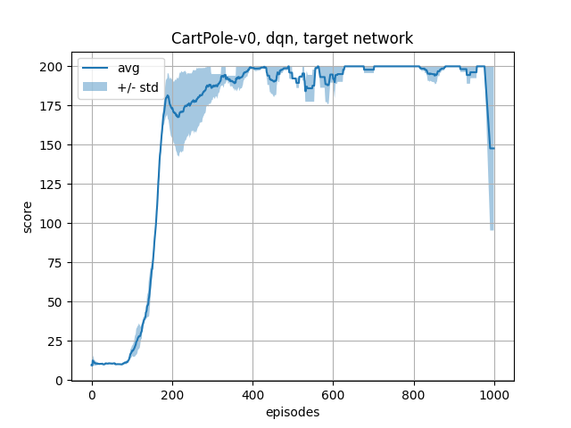

# Practicals

## Requirements

In this session, you will work on a Colab Notebook (https://colab.research.google.com) to avoid painful installation and version conflicts of python packages. You will need a google account to use it (sorry). Basic knowledge of python is also required.

## Goal

The goal of this session is to complete the very basic dqn code proposed in the notebook, in order to solve the `CartPole-v0` environment.

    

## What is expected

### Complete missing code

The DQN algorithm requires the use of a memory replay module. You need to complete (i) the ring buffer class, and (ii) the plotting of episode scores (look for the `# TO DO` sections). For simplicity, we assume that we do one update at each episode step. To test your code, I suggest to keep `n_avg` equal to 2, and `n_ep` equal to 1000.

### Play with the code

Once implemented, try to run your code with different parameters (you can change the initial and final randomness levels, the batch size, the memory size, etc.) What do you observe ? You can also try to use the real q-network instead of the target network in the loss function. How does it affect performance ?

Below is an example of a learning curve obtained without the target network:

    

and with it:

    

